# [LSP4IntelliJ](#sp4intellij) - Language Server Protocol Support for the  Jetbrains Plugins

[](https://travis-ci.com/ballerina-platform/lsp4intellij)
[](https://jitpack.io/#ballerina-platform/lsp4intellij)
[](https://github.com/ballerina-platform/lsp4intellij/commits/master)
[](https://gitter.im/ballerina-platform-lsp4intellij/community?utm_source=badge&utm_medium=badge&utm_campaign=pr-badge)

**Lsp4IntelliJ** is a client library, which provides language server support for IntelliJ IDEA and other Jetbrains IDEs.

It is designed to be used with any IntelliJ plugin as its language server client to get the features that are based on the language server.

Also, it allows the plugin developers to use language-specific language server protocol extensions via the [JSON-RPC](https://en.wikipedia.org/wiki/JSON-RPC) 
protocol.

## Table of Contents
- [**How To Use**](#how-to-use)
- [**Features**](#features)
    - [Code Completion](#code-completion)
    - [Code Formatting](#code-formatting) 
    - [Diagnostics](#diagnostics)
    - [Code Actions](#code-actions)
    - [Goto Definition](#go-to-definition)
    - [Go to References / Find Usages](#goto-references-/-find-usages)
    - [Hover Support](#hover-support)
    - [Workspace Symbols](#workspace-symbols)
    - [Renaming Support](#renaming-support)
- [**User API**](#user-api) 
    - [Timeouts](#timeouts)
- [**License**](#license)
- [**Inspiration**](#inspiration)
- [**Useful Links**](#useful-links)


## How to use 

Follow the steps below to use `Lsp4IntelliJ` in your custom language plugin.

### 1. Add the `lsp4intellij` dependency in the build file of the project.

For instructions on adding **Lsp4IntelliJ** as a dependency when using the below build tools, go to **[jitpack/lsp4intellij](https://jitpack.io/#ballerina-platform/lsp4intellij)**.
  - gradle
  - maven
  - sbt

>**Info:** - The Maven publishing process is currently WIP. Thus, the possibility to add LSP4IntelliJ as a dependency will be available soon in the Maven central.

### 2. Add a plugin.xml file
<details>
<summary>deprecated "components"-based setup</summary>
  1. Add `IntellijLanguageClient` as an application component. 
       ```xml
       <application-components>
           <component>
               <implementation-class>org.wso2.lsp4intellij.IntellijLanguageClient</implementation-class>
           </component>
       </application-components>
       ```
       
  2. Add the following extensions to get the relevant features as listed below.
  
        - Code completion (You can replace the `language` attribute if you already have your own
            [custom language implementations](https://www.jetbrains.org/intellij/sdk/docs/tutorials/custom_language_support/language_and_filetype.html#define-a-language))
            ```xml
            <extensions defaultExtensionNs="com.intellij">
                <completion.contributor implementationClass="org.wso2.lsp4intellij.contributors.LSPCompletionContributor"
                                        id="LSPCompletionContributor" language="any"/>
            </extensions>
            ```
        - Code Formatting
            ```xml
            <actions>
               <action class="org.wso2.lsp4intellij.actions.LSPReformatAction" id="ReformatCode" use-shortcut-of="ReformatCode"
                       overrides="true" text="Reformat Code"/>
               <action class="org.wso2.lsp4intellij.actions.LSPShowReformatDialogAction" id="ShowReformatFileDialog"
                       use-shortcut-of="ShowReformatFileDialog" overrides="true" text="Show Reformat File Dialog"/>
            </actions>
            ```
        - Diagnostics and code actions (You can replace the `language` attribute if you already have your own
          [custom language implementations](https://www.jetbrains.org/intellij/sdk/docs/tutorials/custom_language_support/language_and_filetype.html#define-a-language))
            ```xml
            <extensions defaultExtensionNs="com.intellij">
               <externalAnnotator id="LSPAnnotator" language="TEXT" implementationClass="org.wso2.lsp4intellij.contributors.annotator.LSPAnnotator"/>
            </extensions>
            ```
        - Find Usages 
            ```xml
            <actions>
                <action class="org.wso2.lsp4intellij.actions.LSPReferencesAction" id="LSPFindUsages">
                     <keyboard-shortcut first-keystroke="shift alt F7" keymap="$default"/>
                </action>
            </actions>
            ```
        - Workspace symbols
            ```xml
            <extensions defaultExtensionNs="com.intellij">
                <gotoSymbolContributor implementation="org.wso2.lsp4intellij.contributors.symbol.LSPSymbolContributor"
                                              id="LSPSymbolContributor"/>
            </extensions>
            ```
        - Renaming Support 
            ```xml
            <extensions defaultExtensionNs="com.intellij">
                <renameHandler implementation="org.wso2.lsp4intellij.contributors.rename.LSPRenameHandler" 
                id="LSPRenameHandler" order="first"/>
                <renamePsiElementProcessor implementation="org.wso2.lsp4intellij.contributors.rename
                 .LSPRenameProcessor" id="LSPRenameProcessor" order="first"/>
            </extensions>
            ```
        - Signature Help
            ```xml
            <extensions defaultExtensionNs="com.intellij">
                <typedHandler implementation="org.wso2.lsp4intellij.listeners.LSPTypedHandler"
                              id="LSPTypedHandler"/>
            </extensions>
            ```
        
   > **Note:** You do not need any additional configurations for the other features.
</details>

Copy the example plugin.xml [here](resources/plugin.xml.example) and place it under `src/resources/META-INF` in your plugin and adjust it to your needs.

### 3. Add a preloading activity to configure LSP

Implement a preloading activity in your plugin as shown below.

>**Tip:** For other options you can use instead of implementing a preloading activity, go to [InteliJ Plugin initialization on startup](https://www.plugin-dev.com/intellij/general/plugin-initial-load/)
to)

Example:

```java
public class BallerinaPreloadingActivity extends PreloadingActivity {
    public void preload(ProgressIndicator indicator) {
        IntellijLanguageClient.addServerDefinition(new RawCommandServerDefinition("bal", new String[]{"path/to/launcher-script.sh"}));
    }
}
```

With plugin.xml containing;

```xml
<extensions defaultExtensionNs="com.intellij">
    <preloadingActivity implementation="io.ballerina.plugins.idea.preloading.BallerinaPreloadingActivity" 
                        id="io.ballerina.plugins.idea.preloading.BallerinaPreloadingActivity" />
</extensions>
```

If you have connected to your language server successfully, you will see a green icon at the bottom-right side of your 
IDE when opening a file that has a registered file extension as shown below.

#### Alternative ways to connect to a language server
Aside RawCommandServerDefinition there are several classes implementing [LanguageServerDefinition](src/main/java/org/wso2/lsp4intellij/client/languageserver/serverdefinition/LanguageServerDefinition.java).

You can use the following concrete class:

- **RawCommandServerDefinition(string fileExtension, string[] command)**

  This definition can be used to start a language server using a command.

    * You can specify multiple extensions for a server by separating them with a comma (e.g., "ts,js").

    * If you want to bind your language server definition only with a specific set of files, you can use that
      specific file pattern as a regex expression instead of binding with the file extension (e.g., "application*.properties").

  Examples:

  Ballerina Language Server
    ```java
    new RawCommandServerDefinition("bal", new String[]{"path/to/launcher-script.sh"});
    ```

  BSL Language Server
    ```java
    String[] command = new String[]{"java","-jar","path/to/language-server.jar"};
    new RawCommandServerDefinition("bsl,os",command);
    ```

- **ProcessBuilderServerDefinition(string fileExtension, string[] command)**

  This definition is an extended form of the **RawCommandServerDefinition**, which accepts
  `java.lang.ProcessBuilder` instances so that the users will have more controllability over the language
  server
  process to be created.

    * You can specify multiple extensions for a server by separating them with a comma (e.g., "ts,js").

    * If you want to bind your language server definition only with a specific set of files, you can use that
      specific file pattern as a regex expression instead of binding with the file extension (e.g., "application*.properties").

  Examples:

  Ballerina Language Server
    ```java
    ProcessBuilder process = new ProcessBuilder("path/to/launcher-script.sh");
    new ProcessBuilderServerDefinition("bal", process);
    ```

  BSL Language Server
    ```java
    ProcessBuilder process = new ProcessBuilder("java","-jar","path/to/language-server.jar");
    new ProcessBuilderServerDefinition("bsl,os", process);
    ```
> **Note:** All of the above implementations will use server stdin/stdout to communicate.

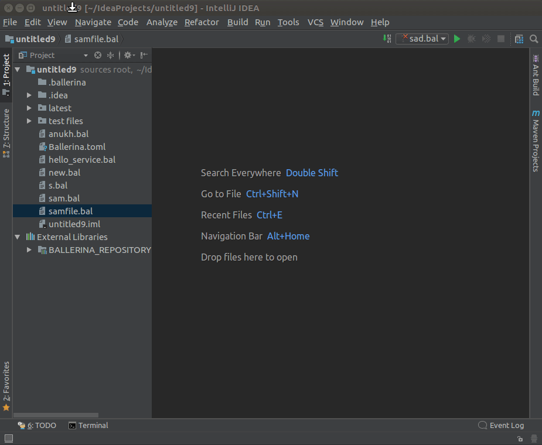
   
>**Tip:** You can also click on the icon to see the connected files and the timeouts.

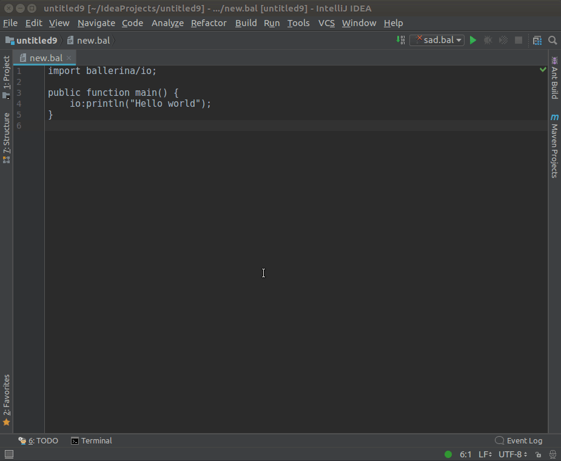
   

## Features 

#### Code Completion (with code snippet support)
Press the `CTRL+SPACE` keys to see the completion items list, which depends on your cursor position.(Code completion items 
will also pop-up auytomatically based on your language-server-specific trigger characters.)

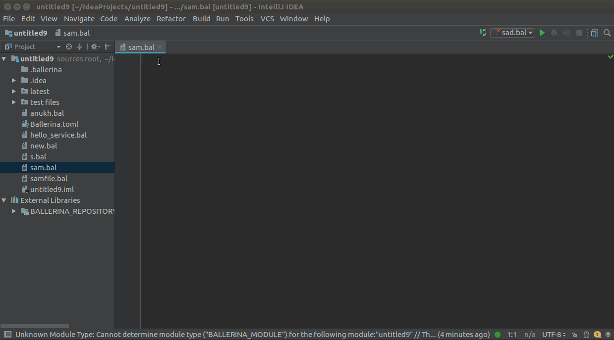


For Code Snippets, you can use TAB/ENTER to navigate to the next place holder position or ESC to apply the code
snippets with the default values.
 
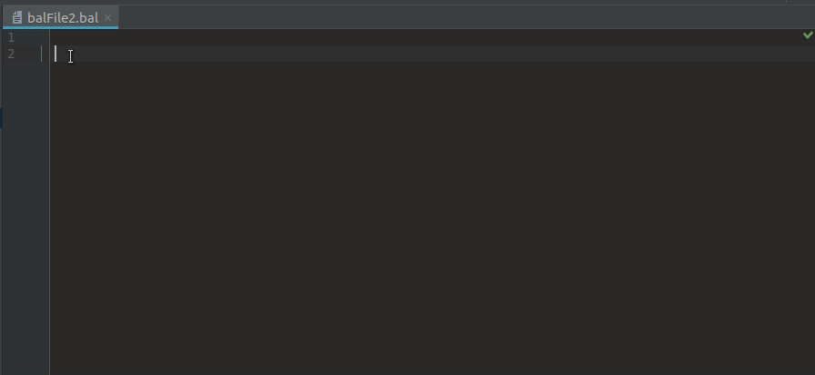


#### Code Formatting 
Navigate to **Code->Reformat Code** and you will get a dialog to choose whether to format the whole file or the 
selected range.

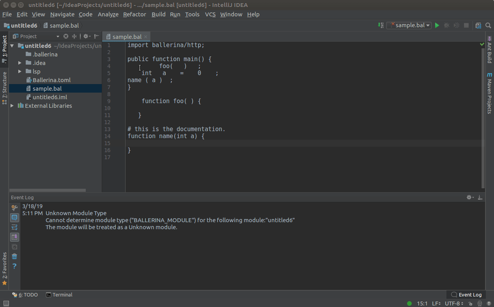

#### Diagnostics 
To see diagnostics (errors, warnings etc.), hover over them to view the message.

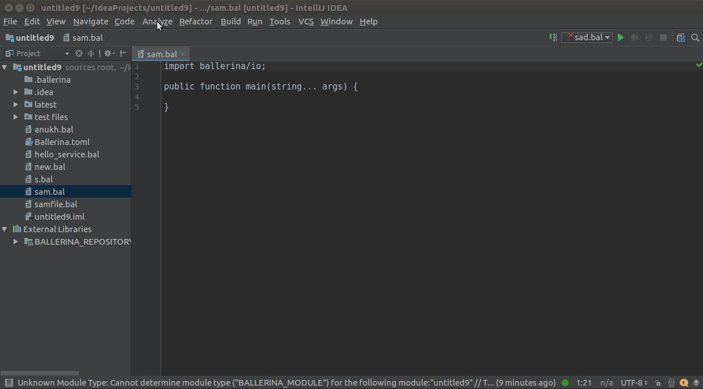

#### Code Actions
Hover over any diagnostic highlight to view and apply related code actions using the light bulb that pops up as 
shown below.
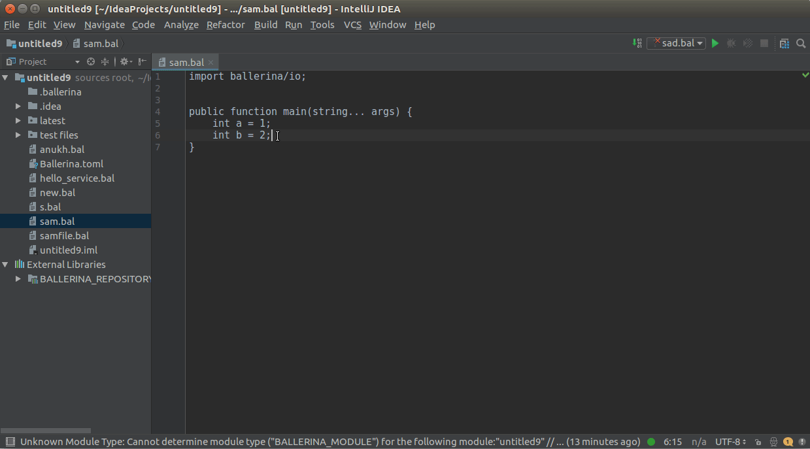  

#### Go to Definition
You can use `CTRL+CLICK`(`COMMAND+CLICK` in MacOS) to navigate to its definition.
 
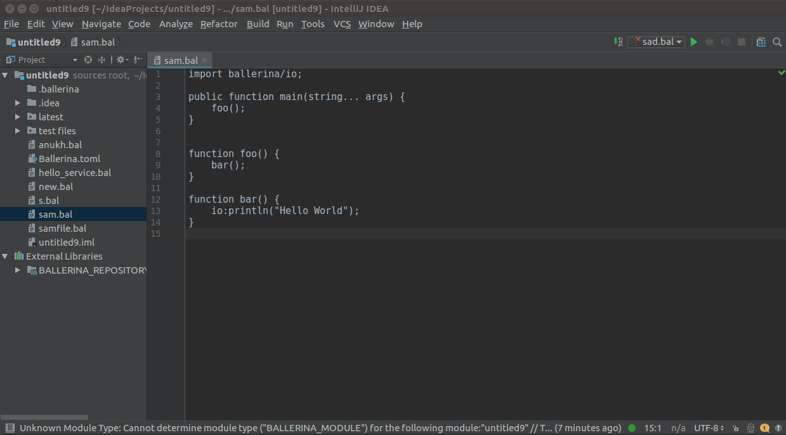

#### Goto References / Find Usages
You can use `CTRL+CLICK`(`COMMAND+CLICK` in MacOS) or `SHIFT+ALT+F7` for a symbol to view the list of its references/usages.
 
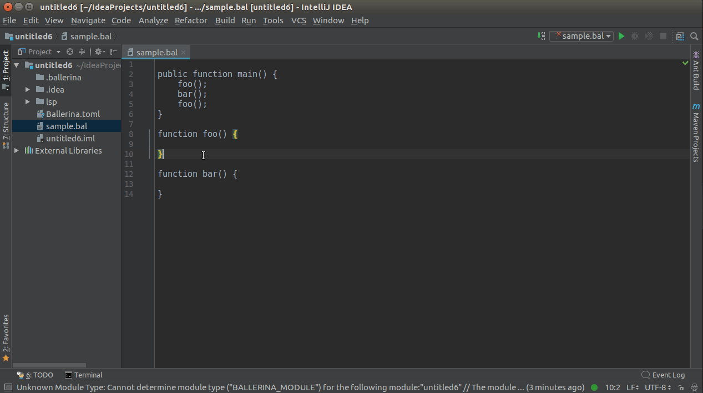

#### Hover Support
You can hover over an element while pressing the `CTRL`(`COMMAND` in MacOS) key to view its documentation if available.

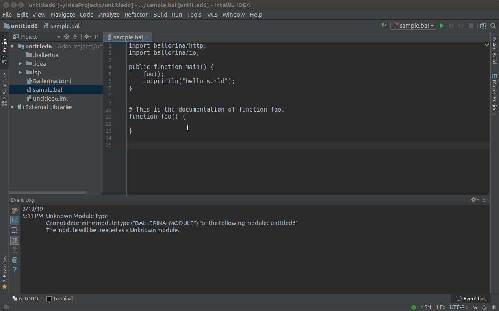

#### Workspace Symbols
Click **Navigate** in the top menu, then click **Symbol...**,  and enter the name of the symbol you want to search in the search box that 
pops up.

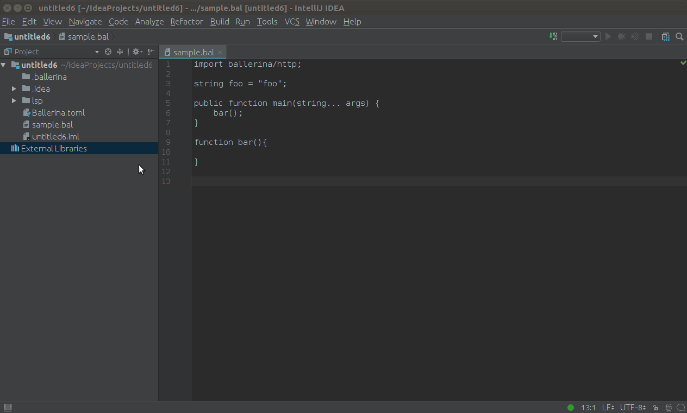

#### Renaming Support
Set the courser to the element which needs to renamed and press `SHIFT+F6` to trigger the in-place renaming as shown
below.

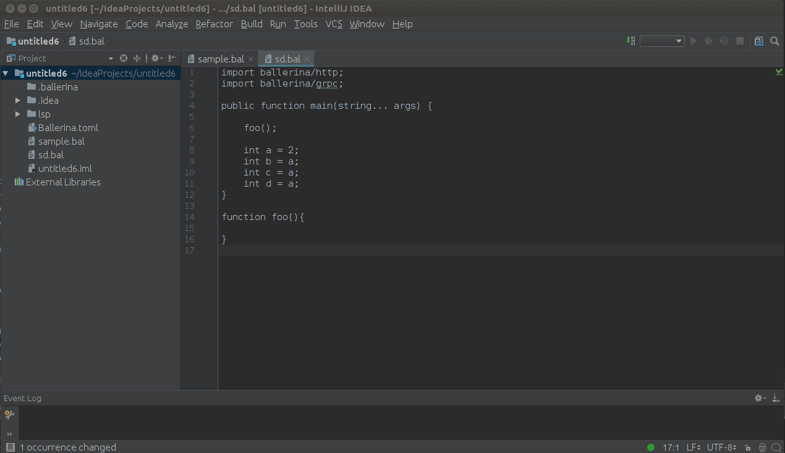

> **Note** - Above features are currently tested only with IntelliJ IDEA and
the [Ballerina Language Server](https://github.com/ballerina-platform/ballerina-lang/tree/master/language-server).

 **WIP Features** 
 - Signature Help
 

## User API 

### Timeouts
The Lsp4IntelliJ language client has default timeout values for LSP-based requests as shown below.

| Type     | Default timeout value(in milliseconds)|
|----------|:-------------------------------------:|
| Code Actions    |  2000 |
| Completion      |  1000 |
| Goto Definition |  2000 |
| Execute Command |  2000 |
| Formatting      |  2000 |
| Hover Support   |  2000 | 
| Initialization  | 10000 |
| References      |  2000 |
| Shutdown        |  5000 |
| WillSave        |  2000 |

The LspIntelliJ language client provides following methods related to timeout configurations.

- **getTimeouts()** - Returns the current timeout values (in milliseconds).

    Example:
    ```java
    Map<Timeouts, Integer> timeouts = IntelliJLnaguageClient.getTimeouts();
    ```

- **getTimeout(Timeouts timeoutType)** - Returns the current timeout value of a given timeout type (in milliseconds).

    Example
    ```java
    int timeout = IntellijLanguageClient.getTimeout(Timeouts.INIT);
    ```

- **setTimeouts(Map<Timeouts, Integer> newTimeouts))** - Overrides the default timeout values with a given set
 of timeout values.
 
    Example
    ```java
    Map<Timeouts,Integer> newTimeouts = new HashMap<>();
    newTimeouts.put(Timeouts.INIT,15000);
    newTimeouts.put(Timeouts.COMPLETION,1000);
    IntellijLanguageClient.setTimeouts(newTimeouts);
    ```
    
- **setTimeout(Timeouts timeout, int value)** - Overrides a specific timeout value with a new one.
 
    Example
    ```java
    IntellijLanguageClient.setTimeout(Timeouts.INIT, 15000);
    ```


## License

The LSP4Intellij code is distributed under the [Apache license 2.0](LICENSE).

 
## Inspiration

`Lsp4IntelliJ` is heavily inspired by the [intellij-lsp](https://github.com/gtache/intellij-lsp) plugin community. 
Credits should go to the original author for his astounding work.


# Useful Links

- [langserver.org](https://langserver.org/)
- [Language Server Protocol Specification](https://microsoft.github.io/language-server-protocol/specification)
