# LSP4IntelliJ - Language Server Protocol Support for JetBrains Plugins

[](https://github.com/ballerina-platform/lsp4intellij/actions/workflows/build.yml)
[](https://jitpack.io/#ballerina-platform/lsp4intellij)
[](LICENSE)
[](#compatibility-matrix)
[](https://github.com/ballerina-platform/lsp4intellij/commits/master)
[](https://gitter.im/ballerina-platform-lsp4intellij/community?utm_source=badge&utm_medium=badge&utm_campaign=pr-badge)

**LSP4IntelliJ** is a client library that enables Language Server Protocol (LSP) support for IntelliJ IDEA and other JetBrains IDEs.

Designed for plugin developers, it facilitates integration with LSP-based features and supports language-specific extensions via the [JSON-RPC](https://en.wikipedia.org/wiki/JSON-RPC) protocol.

---

## Table of Contents

<!-- The TOC below is auto-generated. To regenerate after editing headings, run: npx markdown-toc -i README.md --maxdepth 4 -->
<!-- toc -->

- [Compatibility Matrix](#compatibility-matrix)
- [Projects Powered by LSP4IntelliJ](#projects-powered-by-lsp4intellij)
- [Quick Start](#quick-start)
- [How to Use](#how-to-use)
  * [1. Add the `lsp4intellij` dependency](#1-add-the-lsp4intellij-dependency)
  * [2. Add a `plugin.xml` file](#2-add-a-pluginxml-file)
  * [3. Configure preloading activity](#3-configure-preloading-activity)
  * [4. Confirm language server connection](#4-confirm-language-server-connection)
    + [Alternative ways to connect to a language server](#alternative-ways-to-connect-to-a-language-server)
    + [Custom initialization parameters](#custom-initialization-parameters)
- [Features](#features)
    + [Code Completion (with code snippet support)](#code-completion-with-code-snippet-support)
    + [Code Formatting](#code-formatting)
    + [Diagnostics](#diagnostics)
    + [Code Actions](#code-actions)
    + [Go to Definition](#go-to-definition)
    + [Go to References / Find Usages](#go-to-references--find-usages)
    + [Hover Support](#hover-support)
    + [Workspace Symbols](#workspace-symbols)
    + [Renaming Support](#renaming-support)
- [User API](#user-api)
  * [Timeouts](#timeouts)
- [License](#license)
- [Contributors](#contributors)
- [Inspiration](#inspiration)
- [Useful Links](#useful-links)

<!-- tocstop -->

---

## Compatibility Matrix

The table below groups released `lsp4intellij` artifacts by the IntelliJ IDEA version range they are known to be compatible with and the LSP specification version they support (derived from the bundled `org.eclipse.lsp4j` runtime). Because `lsp4intellij` is consumed as a library, your plugin's own `plugin.xml` ultimately controls runtime compatibility — but picking a library version whose range overlaps your plugin's target avoids API surface mismatches.

| LSP4IntelliJ          | Compatible IDEA versions | Supported LSP spec |
|-----------------------|--------------------------|--------------------|
| `0.95.1` – `0.96.2`   | 2021.1 – 2024.2          | 3.17               |
| `0.95.0`              | 2021.1 – 2024.2          | 3.16               |
| `0.94.0` – `0.94.2`   | 2017.3 – 2020.3          | 3.14               |
| `0.1.0` – `0.92.1`    | 2017.3 – 2020.3          | 3.13               |

> **Note:** Ranges reflect the IDEA versions covered while each release line was actively maintained. No upper bound (`untilBuild`) is enforced in the artifact itself, so newer IDEs are not artificially blocked — but compatibility outside the listed range is unverified and depends on whether the IntelliJ Platform APIs used by the library remain available in the target IDE.

---

## Projects Powered by LSP4IntelliJ

The table below lists known projects using `lsp4intellij`. If your project is missing or should be removed, please open a PR.

| Project                                 | Repository                                                                                                  | Focus                          |
|-----------------------------------------|-------------------------------------------------------------------------------------------------------------|--------------------------------|
| 1C:Enterprise BSL Language Support      | [1c-syntax/intellij-language-1c-bsl](https://github.com/1c-syntax/intellij-language-1c-bsl)                 | 1C BSL / OScript               |
| AWS Smithy IntelliJ                     | [awslabs/smithy-intellij](https://github.com/awslabs/smithy-intellij)                                       | Smithy IDL                     |
| Ballerina IntelliJ Plugin               | [ballerina-platform/plugin-intellij](https://github.com/ballerina-platform/plugin-intellij)                 | Ballerina                      |
| Cadence for IntelliJ Platform           | [cadence-tools/cadence-for-intellij-platform](https://github.com/cadence-tools/cadence-for-intellij-platform) | Cadence (Flow blockchain)      |
| Chester IntelliJ Plugin                 | [chester-lang/chester](https://github.com/chester-lang/chester)                                             | Chester                        |
| CSL IntelliJ Extension                  | [nullptr-0/csl](https://github.com/nullptr-0/csl)                                                           | CSL                            |
| DiveKit Language Plugin                 | [divekit/divekit-language-plugin-intellij](https://github.com/divekit/divekit-language-plugin-intellij)     | DiveKit                        |
| EO IntelliJ LSP Plugin                  | [GeorgySabaev/eo-intellij-lsp-plugin](https://github.com/GeorgySabaev/eo-intellij-lsp-plugin)               | EO                             |
| IntelliJ Jsonnet                        | [zzehring/intellij-jsonnet](https://github.com/zzehring/intellij-jsonnet)                                   | Jsonnet                        |
| IntelliJ V                              | [nedpals/intellij-vlang](https://github.com/nedpals/intellij-vlang)                                         | V                              |
| Marko.js IntelliJ Plugin                | [biaspro/markojs-intellij-plugin](https://github.com/biaspro/markojs-intellij-plugin)                       | Marko.js                       |
| nimtellij                               | [observant2/nimtellij](https://github.com/observant2/nimtellij)                                             | Nim                            |
| Robot Framework LSP (IntelliJ client)   | [robocorp/robotframework-lsp](https://github.com/robocorp/robotframework-lsp)                               | Robot Framework                |
| Seedwing Enforcer IntelliJ              | [seedwing-io/seedwing-enforcer-intellij-plugin](https://github.com/seedwing-io/seedwing-enforcer-intellij-plugin) | Seedwing policy           |
| Spring Tools for IDEA                   | [gayanper/idea-spring-tools](https://github.com/gayanper/idea-spring-tools)                                 | Spring config / properties     |
| Valkyrie IntelliJ                       | [valkyrie-language/valkyrie-intellij](https://github.com/valkyrie-language/valkyrie-intellij)               | Valkyrie                       |
| WDL IDE                                 | [broadinstitute/wdl-ide](https://github.com/broadinstitute/wdl-ide)                                         | Workflow Description Language  |
| Yarn Spinner JetBrains Plugin           | [dogboydog/yarnspinner-jetbrains-plugin](https://github.com/dogboydog/yarnspinner-jetbrains-plugin)         | Yarn Spinner (game dialogue)   |
| Yggdrasil IntelliJ                      | [ygg-lang/yggdrasil-intellij](https://github.com/ygg-lang/yggdrasil-intellij)                               | Yggdrasil grammar              |

---

## Quick Start

The minimum integration is three pieces: add the dependency, register a language server in a preloading activity, and wire that activity into `plugin.xml`. Replace the command and file extension with your own.

**`build.gradle`** — see [JitPack](https://jitpack.io/#ballerina-platform/lsp4intellij) for Maven and SBT snippets.

```gradle
implementation 'com.github.ballerina-platform:lsp4intellij:<version>'
```

**Preloading activity**

```java
public class MyLspPreloader extends PreloadingActivity {
    @Override
    public void preload(@NotNull ProgressIndicator indicator) {
        IntellijLanguageClient.addServerDefinition(
            new RawCommandServerDefinition("mylang", new String[]{"path/to/language-server"}));
    }
}
```

**`plugin.xml`**

```xml
<extensions defaultExtensionNs="com.intellij">
    <preloadingActivity implementation="com.example.MyLspPreloader"
                        id="com.example.MyLspPreloader"/>
</extensions>
```

A green icon in the IDE's bottom-right confirms a successful connection. See [How to Use](#how-to-use) below for the full set of `plugin.xml` extension points, alternative server-definition styles, and custom initialization parameters.

---

## How to Use

Follow the below steps to integrate `LSP4IntelliJ` into your custom language plugin.

### 1. Add the `lsp4intellij` dependency
Include `lsp4intellij` in your project's build file. Instructions for popular build tools are available at [jitpack/lsp4intellij](https://jitpack.io/#ballerina-platform/lsp4intellij).

Supported build tools:
- Gradle
- Maven
- SBT

> **Info:** Maven Central publishing is a work in progress. Support for Maven Central will be available soon.

### 2. Add a `plugin.xml` file
Define the required configurations in your `plugin.xml` file.

<details>
<summary>deprecated "components"-based setup</summary>
  1. Add `IntellijLanguageClient` as an application component. 
       ```xml
       <application-components>
           <component>
               <implementation-class>org.wso2.lsp4intellij.IntellijLanguageClient</implementation-class>
           </component>
       </application-components>
       ```
       
  2. Add the following extensions to get the relevant features as listed below.
  
        - Code completion (You can replace the `language` attribute if you already have your own
            [custom language implementations](https://www.jetbrains.org/intellij/sdk/docs/tutorials/custom_language_support/language_and_filetype.html#define-a-language))
            ```xml
            <extensions defaultExtensionNs="com.intellij">
                <completion.contributor implementationClass="org.wso2.lsp4intellij.contributors.LSPCompletionContributor"
                                        id="LSPCompletionContributor" language="any"/>
            </extensions>
            ```
        - Code Formatting
            ```xml
            <actions>
               <action class="org.wso2.lsp4intellij.actions.LSPReformatAction" id="ReformatCode" use-shortcut-of="ReformatCode"
                       overrides="true" text="Reformat Code"/>
               <action class="org.wso2.lsp4intellij.actions.LSPShowReformatDialogAction" id="ShowReformatFileDialog"
                       use-shortcut-of="ShowReformatFileDialog" overrides="true" text="Show Reformat File Dialog"/>
            </actions>
            ```
        - Diagnostics and code actions (You can replace the `language` attribute if you already have your own
          [custom language implementations](https://www.jetbrains.org/intellij/sdk/docs/tutorials/custom_language_support/language_and_filetype.html#define-a-language))
            ```xml
            <extensions defaultExtensionNs="com.intellij">
               <externalAnnotator id="LSPAnnotator" language="TEXT" implementationClass="org.wso2.lsp4intellij.contributors.annotator.LSPAnnotator"/>
            </extensions>
            ```
        - Find Usages 
            ```xml
            <actions>
                <action class="org.wso2.lsp4intellij.actions.LSPReferencesAction" id="LSPFindUsages">
                     <keyboard-shortcut first-keystroke="shift alt F7" keymap="$default"/>
                </action>
            </actions>
            ```
        - Workspace symbols
            ```xml
            <extensions defaultExtensionNs="com.intellij">
                <gotoSymbolContributor implementation="org.wso2.lsp4intellij.contributors.symbol.LSPSymbolContributor"
                                              id="LSPSymbolContributor"/>
            </extensions>
            ```
        - Renaming Support 
            ```xml
            <extensions defaultExtensionNs="com.intellij">
                <renameHandler implementation="org.wso2.lsp4intellij.contributors.rename.LSPRenameHandler" 
                id="LSPRenameHandler" order="first"/>
                <renamePsiElementProcessor implementation="org.wso2.lsp4intellij.contributors.rename
                 .LSPRenameProcessor" id="LSPRenameProcessor" order="first"/>
            </extensions>
            ```
        - Signature Help
            ```xml
            <extensions defaultExtensionNs="com.intellij">
                <typedHandler implementation="org.wso2.lsp4intellij.listeners.LSPTypedHandler"
                              id="LSPTypedHandler"/>
            </extensions>
            ```
        
   > **Note:** You do not need any additional configurations for the other features.
</details>

Copy the example `plugin.xml` file from [resources/plugin.xml.example](resources/plugin.xml.example), place it under `src/resources/META-INF`, and adjust it as needed.

### 3. Configure preloading activity

Add a preloading activity to initialize and configure LSP support:

```java
public class BallerinaPreloadingActivity extends PreloadingActivity {
    @Override
    public void preload() {
        IntellijLanguageClient.addServerDefinition(new RawCommandServerDefinition("bal", new String[]{"path/to/launcher-script.sh"}));
    }

    @Override
    public void preload(ProgressIndicator indicator) {
        preload();
    }
}
```

Update your `plugin.xml` to include the preloading activity:

```xml
<extensions defaultExtensionNs="com.intellij">
    <preloadingActivity implementation="io.ballerina.plugins.idea.preloading.BallerinaPreloadingActivity" 
                        id="io.ballerina.plugins.idea.preloading.BallerinaPreloadingActivity" />
</extensions>
```

>**Tip:** For other options you can use instead of implementing a preloading activity, go to [IntelliJ Plugin initialization on startup](https://www.plugin-dev.com/intellij/general/plugin-initial-load/)

### 4. Confirm language server connection

After successfully connecting to the language server, a green icon will appear in the bottom-right corner of your IDE. Clicking on the icon will display connection details and timeouts.

#### Alternative ways to connect to a language server

In addition to `RawCommandServerDefinition`, several classes implement [LanguageServerDefinition](src/main/java/org/wso2/lsp4intellij/client/languageserver/serverdefinition/LanguageServerDefinition.java), allowing you to connect to a language server in different ways. Below are the available options:

##### 1. RawCommandServerDefinition

You can specify multiple extensions for a server by separating them with a comma (e.g., "ts,js").

If you want to bind your language server definition only with a specific set of files, you can use that
specific file pattern as a regex expression instead of binding with the file extension (e.g., "application*.properties").

**Example Usage:**

```java
new RawCommandServerDefinition("bal", new String[]{"path/to/launcher-script.sh"});
```

```java
String[] command = new String[]{"java", "-jar", "path/to/language-server.jar"};
new RawCommandServerDefinition("bsl,os", command);
```

##### 2. ProcessBuilderServerDefinition

This definition is an extended form of the **RawCommandServerDefinition**, which accepts
`java.lang.ProcessBuilder` instances so that the users will have more controllability over the language
server
process to be created.

You can specify multiple extensions for a server by separating them with a comma (e.g., "ts,js").

If you want to bind your language server definition only with a specific set of files, you can use that
      specific file pattern as a regex expression instead of binding with the file extension (e.g., "application*.properties").

**Example Usage:**

```java
ProcessBuilder process = new ProcessBuilder("path/to/launcher-script.sh");
new ProcessBuilderServerDefinition("bal", process);
```

```java
ProcessBuilder process = new ProcessBuilder("java", "-jar", "path/to/language-server.jar");
new ProcessBuilderServerDefinition("bsl,os", process);
```

#### Custom initialization parameters

If your language server requires custom initialization options, you can extend `ProcessBuilderServerDefinition` or `RawCommandServerDefinition` and override the `customizeInitializeParams` method to modify the initialization parameters.

```java
public class MyServerDefinition extends ProcessBuilderServerDefinition {
    public MyServerDefinition(String ext, ProcessBuilder process) {
        super(ext, process);
    }

    @Override
    public void customizeInitializeParams(InitializeParams params) {
        params.clientInfo = new ClientInfo("MyName", "MyVersion");
    }
}
```

Finally, assign your class as a ServerDefinition:

```java
ProcessBuilder process = new ProcessBuilder("path/to/launcher-script.sh");
IntellijLanguageClient.addServerDefinition(new MyServerDefinition("xxx", processBuilder));
```

  You can refer to [#311](https://github.com/ballerina-platform/lsp4intellij/pull/311) for more details.


> **Note:** All implementations use stdin/stdout for server communication.

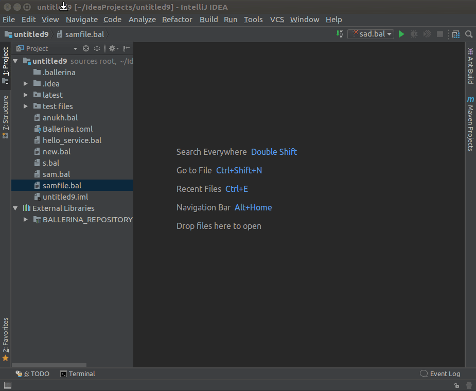
   
>**Tip:** A green icon in the IDE's bottom-right corner indicates successful connection to the language server. Clicking on the icon will display connection details and timeouts.

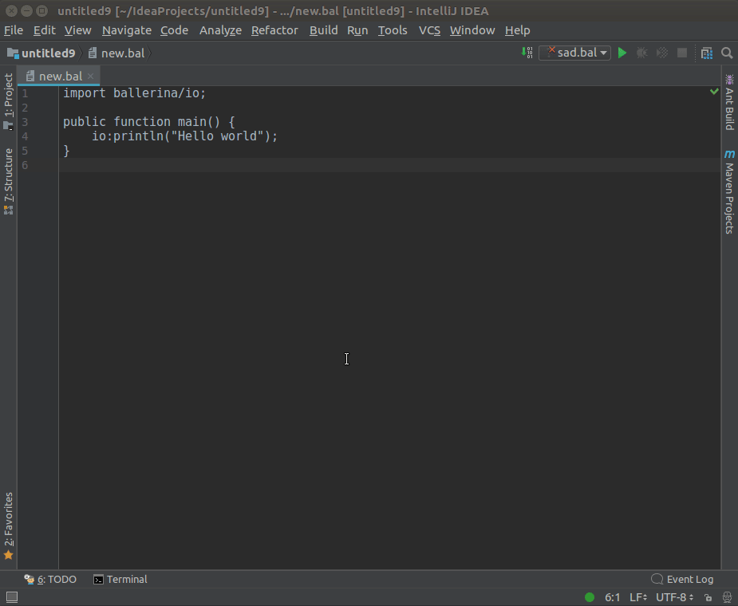
   
--- 

## Features

#### Code Completion (with code snippet support)
Press the `CTRL+SPACE` keys to see the completion items list, which depends on your cursor position.(Code completion items 
will also pop-up automatically based on your language-server-specific trigger characters.)

<details><summary>Show demo</summary>

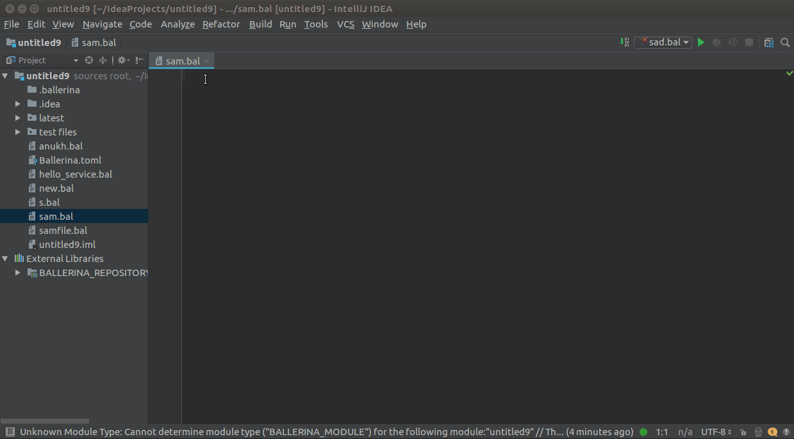

</details>

For Code Snippets, you can use TAB/ENTER to navigate to the next place holder position or ESC to apply the code
snippets with the default values.

<details><summary>Show demo</summary>

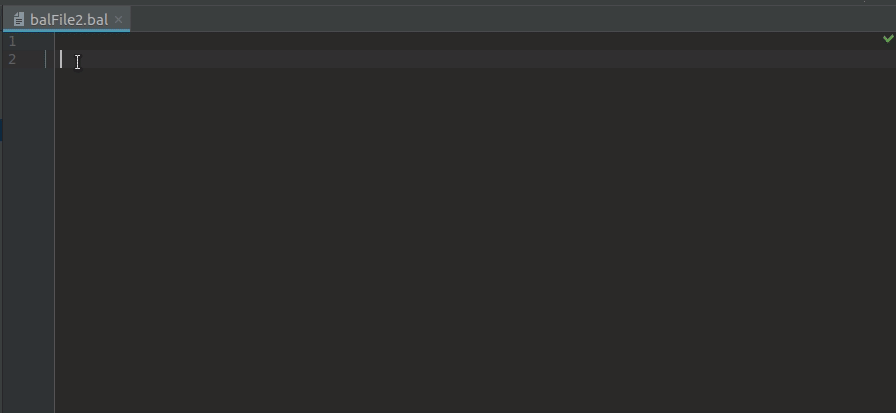

</details>

#### Code Formatting
Navigate to **Code->Reformat Code** and you will get a dialog to choose whether to format the whole file or the 
selected range.

<details><summary>Show demo</summary>

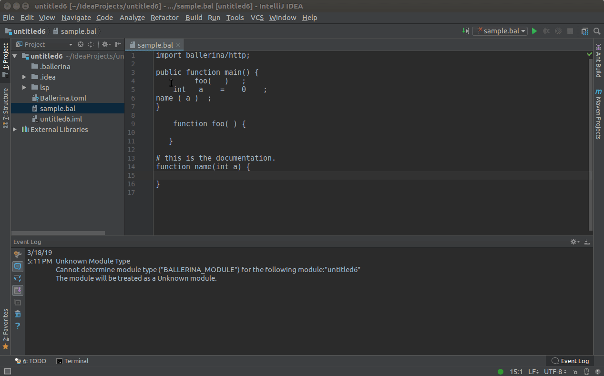

</details>

#### Diagnostics
To see diagnostics (errors, warnings etc.), hover over them to view the message.

<details><summary>Show demo</summary>

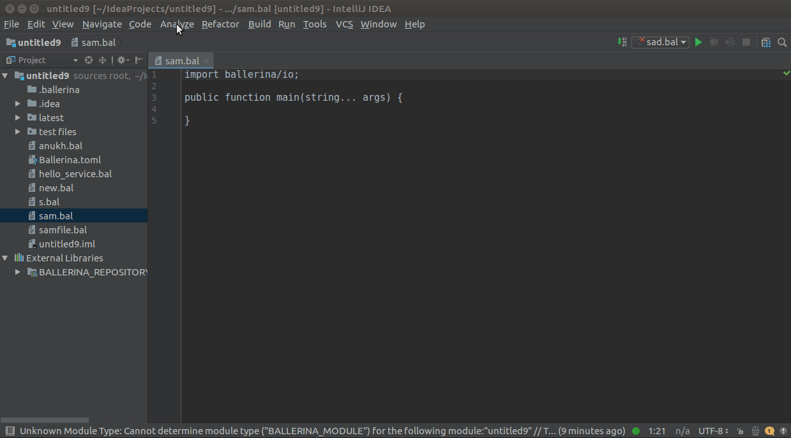

</details>

#### Code Actions
Hover over any diagnostic highlight to view and apply related code actions using the light bulb that pops up as 
shown below.

<details><summary>Show demo</summary>

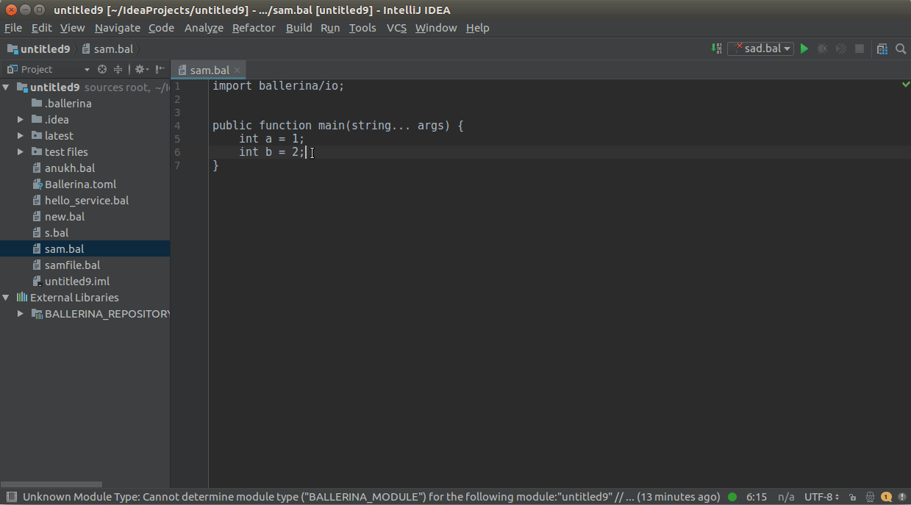

</details>

#### Go to Definition
You can use `CTRL+CLICK`(`COMMAND+CLICK` in MacOS) to navigate to its definition.

<details><summary>Show demo</summary>

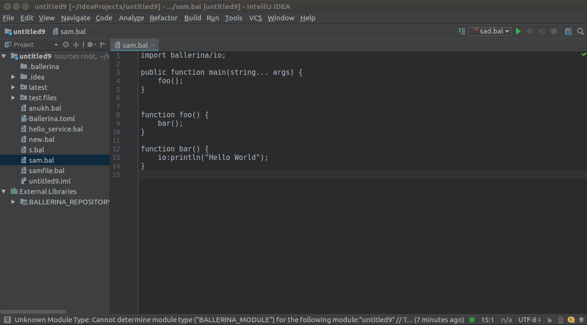

</details>

#### Go to References / Find Usages
You can use `CTRL+CLICK`(`COMMAND+CLICK` in MacOS) or `SHIFT+ALT+F7` for a symbol to view the list of its references/usages.

<details><summary>Show demo</summary>

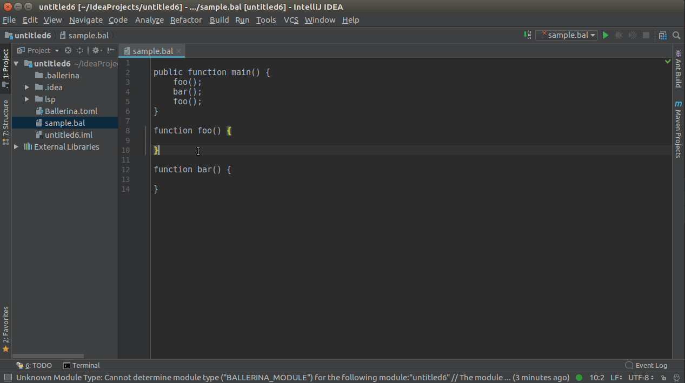

</details>

#### Hover Support
You can hover over an element while pressing the `CTRL`(`COMMAND` in MacOS) key to view its documentation if available.

<details><summary>Show demo</summary>

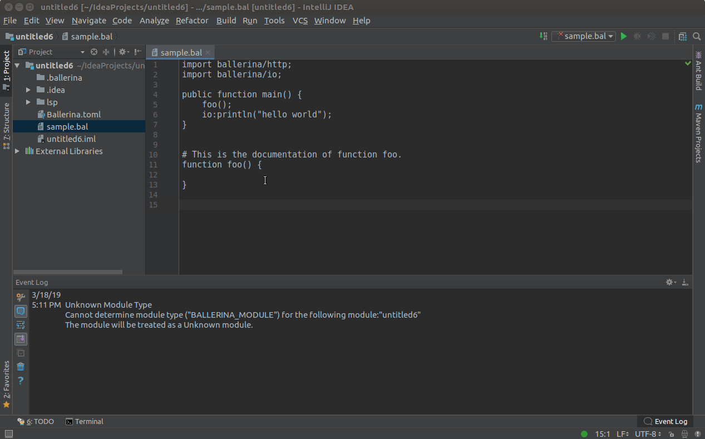

</details>

#### Workspace Symbols
Click **Navigate** in the top menu, then click **Symbol...**,  and enter the name of the symbol you want to search in the search box that 
pops up.

<details><summary>Show demo</summary>

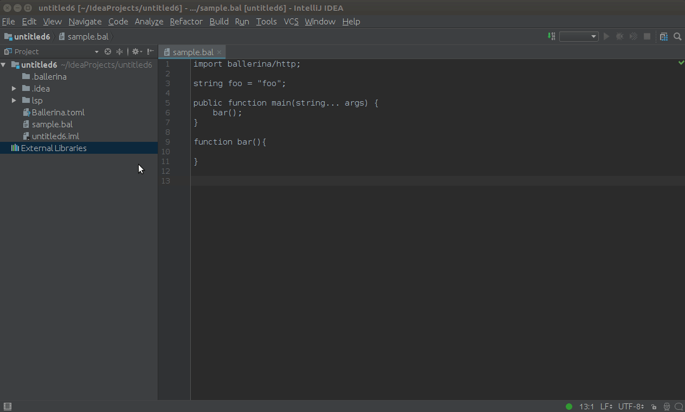

</details>

#### Renaming Support
Set the cursor to the element which needs to renamed and press `SHIFT+F6` to trigger the in-place renaming as shown
below.

<details><summary>Show demo</summary>

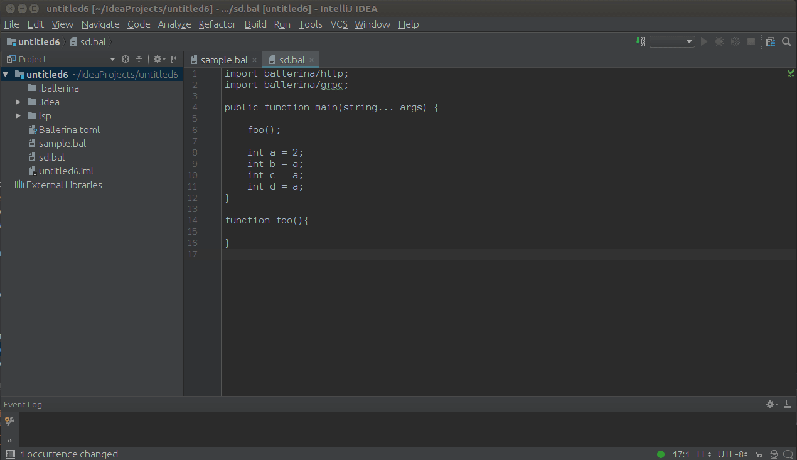

</details>

> **Note** - Above features are currently tested only with IntelliJ IDEA and
> the [Ballerina Language Server](https://github.com/ballerina-platform/ballerina-lang/tree/master/language-server).

**WIP Features**
- Signature Help
 
---

## User API

### Timeouts
The LSP4IntelliJ language client has default timeout values for LSP-based requests as shown below.

| Type            | Default timeout value(in milliseconds) |
|-----------------|:--------------------------------------:|
| Code Actions    |                  2000                  |
| Completion      |                  1000                  |
| Goto Definition |                  2000                  |
| Execute Command |                  2000                  |
| Formatting      |                  2000                  |
| Hover Support   |                  2000                  | 
| Initialization  |                 10000                  |
| References      |                  2000                  |
| Shutdown        |                  5000                  |
| WillSave        |                  2000                  |

The LSP4IntelliJ language client provides following methods related to timeout configurations.

- **getTimeouts()** - Returns the current timeout values (in milliseconds).

    Example:
    ```java
    Map<Timeouts, Integer> timeouts = IntellijLanguageClient.getTimeouts();
    ```

- **getTimeout(Timeouts timeoutType)** - Returns the current timeout value of a given timeout type (in milliseconds).

    Example
    ```java
    int timeout = IntellijLanguageClient.getTimeout(Timeouts.INIT);
    ```

- **setTimeouts(Map<Timeouts, Integer> newTimeouts))** - Overrides the default timeout values with a given set
 of timeout values.
 
    Example
    ```java
    Map<Timeouts,Integer> newTimeouts = new HashMap<>();
    newTimeouts.put(Timeouts.INIT,15000);
    newTimeouts.put(Timeouts.COMPLETION,1000);
    IntellijLanguageClient.setTimeouts(newTimeouts);
    ```
    
- **setTimeout(Timeouts timeout, int value)** - Overrides a specific timeout value with a new one.
 
    Example
    ```java
    IntellijLanguageClient.setTimeout(Timeouts.INIT, 15000);
    ```

---

## License

The LSP4Intellij code is distributed under the [Apache license 2.0](LICENSE).


## Contributors

A huge thanks to all the amazing contributors! 🚀

<a href="https://github.com/ballerina-platform/lsp4intellij/pulse">  </a> 


## Inspiration

`LSP4IntelliJ` is heavily inspired by the [intellij-lsp](https://github.com/gtache/intellij-lsp) plugin community.
Credits should go to the original author for his astounding work.


## Useful Links

- [langserver.org](https://langserver.org/)
- [Language Server Protocol Specification](https://microsoft.github.io/language-server-protocol/specification)
